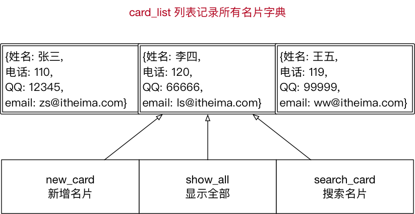

# 综合应用--名片管理系统

## 目标

综合应用已经学过的知识点开发名片管理系统

- 变量
- 流程控制
- 函数
- 模块

## 系统需求

1. 程序启动，显示名片管理系统欢迎界面，并显示功能菜单

```
******************************
欢迎使用 【名片管理系统】 V1.0

1. 新建名片
2. 显示全部
3. 查询名片

0. 退出系统
******************************
```

2. 用户用数字选择不同的功能
3. 根据功能选择，执行不同的功能
4. 用户名片需要记录用户的**姓名、电话、QQ、邮件**
5. 如果查询到指定的名片，用户可以选择修改或者删除名片

## 步骤

1. 框架搭建
2. 新增名片
3. 显示所有名片
4. 查询名片
5. 查询成功后修改、删除名片
6. 让 Python 程序能够直接运行

## 01.框架搭建

- 搭建名片管理系统框架结构
	1. 准备文件，确定文件名，保证能够在需要的位置编写代码
	2. 编写主运行程序，实现基本的用户输入和判断

### 1.1 文件准备

1. 新建 `card_main.py` 保存主程序功能代码
	- 程序的入口
	- 每一次启动名片管理系统都通过 `main` 这个文件启动
2. 新建 `cards_tools.py` 保存所有名片功能函数
	- 将对名片的**新增、查询、修改、删除**等功能封装在不同的函数中

### 1.2 编写主运行循环

- 在 `cards_main` 中添加一个无限循环

```python
# 无限循环，由用户决定何时结束
while True:
    
    # TODO 显示功能菜单

    action_str = input("请选择希望执行的操作：")
    print("您选择的操作是 【%s】" % action_str)

    # 1,2,3 针对名片的操作
    if action_str in ["1", "2", "3"]:
        # 如果在程序开发时，不希望立刻编写分支内部的代码
        # 可以使用 pass 关键字，表示一个占位符，能够保证程序结构正确！
        # 程序运行时，pass 关键字不会执行任何的操作
        pass
    # 0 退出系统
    elif action_str == "0":
        print("欢迎再次使用【名片管理系统】")
        # pass
        break
    # 其他内容输入错误，提示用户
    else:
        print("您输入的不正确，请重新选择")
```

字符串判断

```python
if action_str in ["1", "2", "3"]
```

```python
if action_str == "1" or action_str == "2" or action_str == "3":
```

1. 使用 `in` 针对列表判断，避免使用 `or` 拼接复杂的逻辑条件
2. 没有使用 `int` 转换用户输入，可以避免**一旦用户输入的不是数字**，导致程序运行出错

**pass**

- `pass` 就是一个空语句，不做任何事情，一般用作占位语句
- 是为了保持程序结构的完整性

**无限循环**

- 在开发软件时，如果不希望程序执行后立即退出
- 可以在程序中增加一个无限循环
- 由用户来决定退出程序的时机

**TODO 注释**

- 在 `#` 后更上 `TODO` ，用于标记需要去做的工作

```python
# TODO (作者/邮件) 显示系统菜单
```

## 02.保存名片数据的结构

**程序就是用来处理数据的，而变量就是用来存储数据的**

- 使用**字典**记录每一种名片的详细信息
- 使用 列表统一记录所有**名片字典**



**定义名片列表变量**

- 在 `cards_tools` 文件的顶部增加一个列表变量

```
# 所有名片记录的列表
card_list = []
```

>1. 所有名片相关操作，都需要使用这个列表，所以应该定义在程序的顶部
>2. 程序刚运行时，没有数据，所以是空列表

- `cards_main.py`

```python
# 无限循环，由用户决定何时结束
import cards_tools
while True:

    # 显示功能菜单
    cards_tools.show_menu()

    action_str = input("请选择希望执行的操作：")
    print("您选择的操作是 【%s】" % action_str)

    # 1,2,3 针对名片的操作
    if action_str in ["1", "2", "3"]:
        # 如果在程序开发时，不希望立刻编写分支内部的代码
        # 可以使用 pass 关键字，表示一个占位符，能够保证程序结构正确！
        # 程序运行时，pass 关键字不会执行任何的操作

        # 新增名片
        if action_str == "1":
            cards_tools.new_card()
        # 显示全部
        elif action_str == "2":
            cards_tools.show_all()
        # 查询名片
        else:
            cards_tools.search_card()
    # 0 退出系统
    elif action_str == "0":
        print("-" * 50)
        print("退出系统")
        print("欢迎再次使用【名片管理系统】")
        # pass
        break
    # 其他内容输入错误，提示用户
    else:
        print("您输入的不正确，请重新选择")

```

- `cards_tools.py`

```python
# 记录所有的名片字典
card_list = []


def show_menu():
    """显示菜单"""
    print("*" * 50)
    print("欢迎使用 【名片管理系统】V1.0")
    print()
    print("1. 新增名片")
    print("2. 显示全部")
    print("3. 搜索名片")
    print()
    print("0. 退出系统")
    print("*" * 50)


def new_card():
    """新增名片"""
    print("-" * 50)
    print("新增名片")
    # 1.提示用户输入名片的详细信息
    name_str = input("请输入姓名：")
    phone_str = input("请输入电话：")
    qq_str = input("请输入QQ：")
    email_str = input("请输入邮箱：")

    # 2.使用用户输入的信息建立一个名片字典
    card_dict = {"name": name_str, "phone": phone_str,
                 "qq": qq_str, "email": email_str}

    # 3.及那个名片字典添加到列表中
    card_list.append(card_dict)
    print(card_list)

    # 4.提示用户添加成功
    print("添加 %s 的名片成功" % name_str)


def show_all():
    """显示所有名片"""
    print("-" * 50)
    print("显示所有名片")

    # 判断是否存在名片记录，如果没有，提示用户且返回
    if len(card_list) == 0:
        print("当前名片没有任何记录，请使用新增功能添加名片！")
        # return 可以返回一个函数执行结果
        # 下方的代码不会被执行
        # 如果 return 后面没有任何的内容，表示会返回到调用函数的位置
        # 并且不会返回任何的结果
        return

    # 打印表头
    for name in ["姓名", "电话", "QQ", "邮箱"]:
        print(name, end="\t\t")
    print()
    # 打印分隔线
    print("=" * 50)
    # 遍历名片列表依次输出字典信息
    for card_dict in card_list:
        # print(card_dict)
        print("%s\t\t%s\t\t%s\t\t%s" % (card_dict["name"], card_dict["phone"],
                                        card_dict["qq"], card_dict["email"]))


def search_card():
    """搜索名片"""
    print("-" * 50)
    print("搜索名片")

    # 1.提示用户输入要搜索的姓名
    find_name = input("请输入要搜索的姓名：")
    # 2.遍历名片列表，查询要搜索的姓名，如果没有找到，需要提示用户
    for card_dict in card_list:
        if card_dict["name"] == find_name:
            print("姓名\t\t电话\t\tQQ\t\t邮箱")
            print("=" * 50)
            print("%s\t\t%s\t\t%s\t\t%s" % (card_dict["name"], card_dict["phone"],
                                            card_dict["qq"], card_dict["email"]))

            # 针对找到的名片进行修改/删除操作
            deal_card(card_dict)

            break
    else:
        print("抱歉，没有找到 %s" % find_name)


def deal_card(find_dict):
    """处理查找到的名片"""
    action_str = input("请输入您想执行的操作"
                       "[1] 修改 [2] 删除 [3] 返回上级菜单：")
    if action_str == "1":
        find_dict["name"] = input_card_info(find_dict["name"], "姓名【回车不修改】: ")
        find_dict["phone"] = input_card_info(find_dict["phone"], "电话【回车不修改】: ")
        find_dict["qq"] = input_card_info(find_dict["qq"], "QQ号【回车不修改】: ")
        find_dict["email"] = input_card_info(find_dict["email"], "邮箱【回车不修改】: ")
        print("修改成功")
    elif action_str == "2":
        card_list.remove(find_dict)
        print("删除成功")


def input_card_info(dict_value, tip_message):
    """修改名片信息
    :param dict_value: 字典中原有的值
    :param tip_message: 输入的提示信息
    :return: 如果用户输入了内容，就返回内容，否则返回字典中原有的值
    """
    # 1.提示用户输入内容
    result_str = input(tip_message)
    # 2.针对用户的输入进行判断，如果用户输入内容，直接返回结果
    if len(result_str) > 0:
        return result_str
    # 3.如果用户没有输入内容，返回字典中原有的值
    else:
        return dict_value

```

## 03.LINUX上的 Shebang 符号(#!)

- `#!` 这个符号叫作 `Shebang` 或者 `Sha-bang`
- `Shebang` 通常在 `Unix` 系统脚本中的**第一行开头**使用
- **指明执行这个脚本文件的解释程序**

**使用 Shebang 的步骤**

1. 使用 `which` 查询 `python3` 解释器的路径

```
$ which python3
```

2. 修改要运行的主Python文件，在第一行增加以下内容

```
#! /usr/bin/python3
```

3. 修改主Python文件的文件权限，增加可执行权限

```
$ chmod +x cards_main.py
```

4. 在需要时执行程序即可

```
./cards_main.py
```