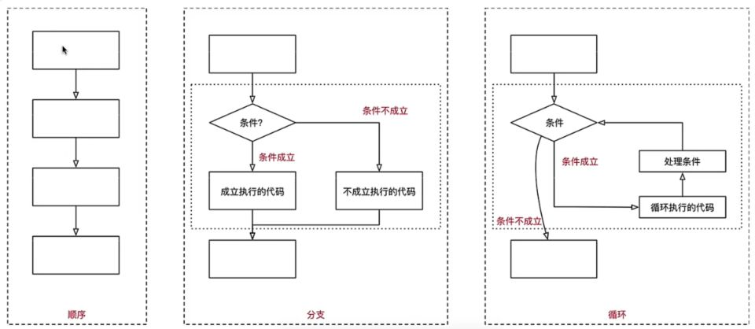

# 循环

## 目标

- 程序的三大流程
- while循环基本使用
- break 和 continue
- while 循环嵌套

## 01.程序的三大流程

- 在程序开发中，一共有三种流程方式
	- **顺序** -- **从上向下**，顺序执行代码
	- **分支** -- 根据条件判断，决定执行代码的 **分支**
	- **循环** -- 让 **特定代码 重复** 执行



## 02.while循环基本使用

- 循环的作用就是让 **指定的代码** 重复的执行
- `while` 循环最常用的应用场景就是 **让执行的代码 按照 指定的次数 重复**执行

### 2.1 while 语句基本语法

```
初始条件设置 - 通常是重复执行的 计数器

while 条件(判断 计数器 是否达到 目标次数):
	条件满足时，做的事情1
	条件满足时，做的事情2
	...(省略)...
	处理条件(计数器 + 1)
```

注意

- `while` 语句以及缩进部分是一个 **完整的代码块**
- 循环结束后，之前定义的计数器条件的数值是依旧存在的

**死循环**

>由于程序员的原因，忘记 在循环内部 修改循环的判断条件，导致循环持续执行，程序无法终止！

### 2.2 赋值运算符

- 在 Python 中，使用 `=` 可以给变量赋值
- 在算术运算时，为了简化代码的编写，`Python`还提供了一系列的 与 算数运算符 对应的 赋值运算符
- 注意：**赋值运算符中间不能使用空格**

| 运算符 | 描述                 | 实例 |
| ------ | -------------------- | ---- |
| `=`    | 简单的赋值运算符     | `c = a + b` 将 `a + b` 的运算符结果赋值为 `c`     |
| `+=`   | 加法赋值运算符       | `i += 1` 等价于 `i = i + 1`     |
| `-=`   | 减法赋值运算符       |      |
| `*=`   | 乘法赋值运算符       |      |
| `/=`   | 除法赋值运算符       |      |
| `//=`  | 取整除赋值运算符     |      |
| `%=`   | 取模(余数)赋值运算符 |      |
| `**=`  | 幂赋值运算符         |      |

### 2.3 Python 中的计数方法

常见的计数方法有两种，可以分别称为

- **自然计数法(从 1 开始)** -- 更符合人类的习惯
- **程序计数法(从 0 开始)** -- 几乎所有的程序语言都选择从0开始计数

因此，在编写程序，应该尽量养成习惯；**除非需求的特殊要求，否则 循环 的计数都从0开始**

### 2.4 循环计算

>在程序开发中，通常会遇到 利用循环 重复计算 的需求

遇到这种需求，可以：

1. 在 `while` 上定义一个变量，用于 **存放最终计算结果**
2. 在循环体内部，每次循环都用 **最新的计算结果，更新** 之前定义的变量

需求

- 计算 0~100 之间所有数字的累计求和结果

```python
# 计算 0！100 之间所有数字的累计求和结果
# 0. 定义最终结果的变量
result = 0
# 1. 定义一个整数的变量记录循环的次数
i = 0

# 2. 开始循环
while i <= 100:
    print(i)
    # 每一次循环，都让 result 这个变量和 i 这个计数器相加
    result += i
    i += 1
print("0~100 之间的数字求和结果 = %d" % result)
```

需求进阶

- 计算 0~100 之间 所有 **偶数** 的累计求和结果

开发步骤

1. 编写循环 确认 要计算的数字
2. 添加 结果 变量，在循环内部 处理计算结果

```python
# 计算 0~100 之间 所有 偶数 的累计求和结果
i, sum = 0, 0
while i <= 100:
    # 判断变量 i 中的数值，是否是一个偶数
    # 偶数 i % 2 == 0
    # 奇数 i % 2 != 0
    if i % 2 == 0:
        print(i)
        sum += i
    i += 1
print("sum = %d" % sum)
```

## 03. break 和 continue

> `break` 和 `continue` 是专门在循环中使用的关键字

- `break` 某一条件满足时，退出循环，不再执行后续重复的代码
- `continue` 某一条件满足时，不执行后续重复的代码

> `break` 和 `continue` 只针对 **当前所在循环** 有效

```python
i = 0
while i < 10:
    # break 某一条件满足时，退出循环，不再执行后续重复的代码
    # i == 3
    if i == 3:
        break
    print(i)
    i += 1

print("over")
```

```python
i = 0
# 输出 0~10 不包括3
while i < 10:
    # - `continue` 某一条件满足时，不执行后续重复的代码
    # i == 3
    if i == 3:
        # 注意：在循环中，如果使用 continue 这个关键字
        # 在使用关键字之前，需要确认循环的计数是否修改，
        # 否则可能会导致死循环
        i += 1
        continue
    
    print(i)
    i += 1

print("over")
```

## 04. while 循环嵌套

### 4.1 循环嵌套

- `while` 嵌套就是：`while` 里面还有 `while`

```
while 条件1：
	条件满足时，做的事情1
	条件满足时，做的事情2
	...(省略)...

	while 条件2：
		条件满足时，做的事情1
		条件满足时，做的事情2
		...(省略)...
		处理条件2
	处理条件1
```

### 4.2 循环嵌套演练 -- 九九乘法表

第一步：用嵌套打印小星星

需求

- 在控制台连续输出五行 `*` ，每一行星号的数量次数递增

```
*
**
***
****
*****
```

- 使用字符串 `*` 打印

```python
# 1.定义一个计数器变量，从数字1开始，循环会比较方便
row = 1

# 2.开始循环
while row <= 5:
    print("*" * row)
    row += 1
```

第 2 步：使用循环嵌套打印小星星

- 默认情况下，`print` 函数输出内容之后，会自动在内容末尾增加换行
- 如果不希望末尾增加换行，可以在 `print` 函数输出内容的后面增加 `, end=""`
- 其中 `""` 中间可以指定 `print` 函数输出内容之后，继续希望显示的内容
- 语法格式如下：

```python
# 向控制台输出内容结束之后，不会换行
print("*", end="")

# 单纯的换行
print("")
```

>`end=""` 表示向控制台输出内容结束之后，不会换行

假设 `python` 没有提供 字符串的 `*` 操作，拼接字符串

开发步骤

- 1> 完成5行内容的简单输出
- 2> 分析每行内部的 `*` 应该如何处理？

```python
row = 1
while row <= 5:

    # 每一行要打印的星星就是和当前的行数是一致的
    # 增加一个小的循环，专门负责当前行中，每一列的星星显示
    # 1. 定义一个列计数器变量
    col = 1
    # 2.开始循环
    while col <= row:
        print("*", end="")
        col += 1
    print() # 每打印一行换行一次
    row += 1
```

第 3 步：九九乘法表

需求 输出 九九乘法表，格式 `略`

```python
# 打印九九乘法表
row = 1
while row <= 9:
    col = 1
    while col <= row:
        print("%d * %d = %d" % (col, row, row * col), end="\t") # 使用横向制表位对齐文本
        col += 1
    print()
    row += 1
```

## 05 字符串中的转义字符

- `\t` 在控制台输出一个 **制表符**，协助在输出文本时 **垂直方向** 保持对齐
- `\n` 在控制台输出一个 **换行符**

>**制表符** 的功能是在不适用表格的情况下在 **垂直方向** 按列对齐文本

| 转义字符 | 描述       |
| -------- | ---------- |
| `\\`     | 反斜杠符号 |
| `\'`     | 单引号     |
| `\"`     | 双引号     |
| `\t`     | 横向制表符 |
| `\r`     | 回车       |
| `\n`     | 换行           |