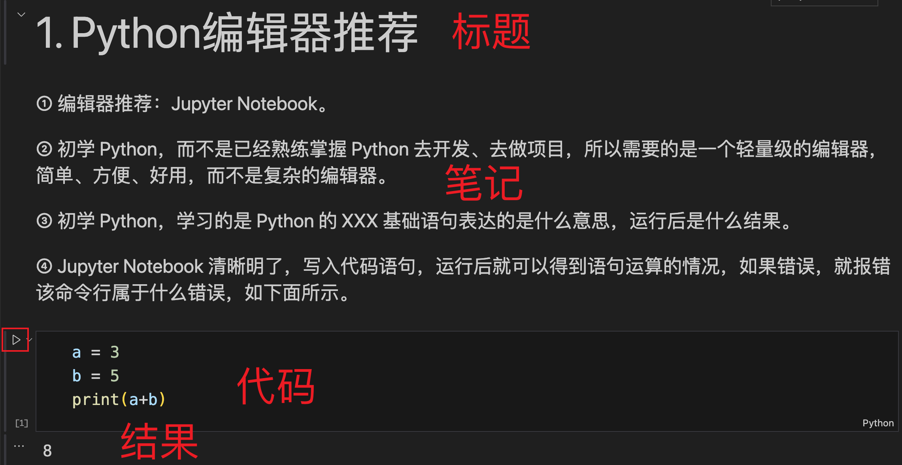
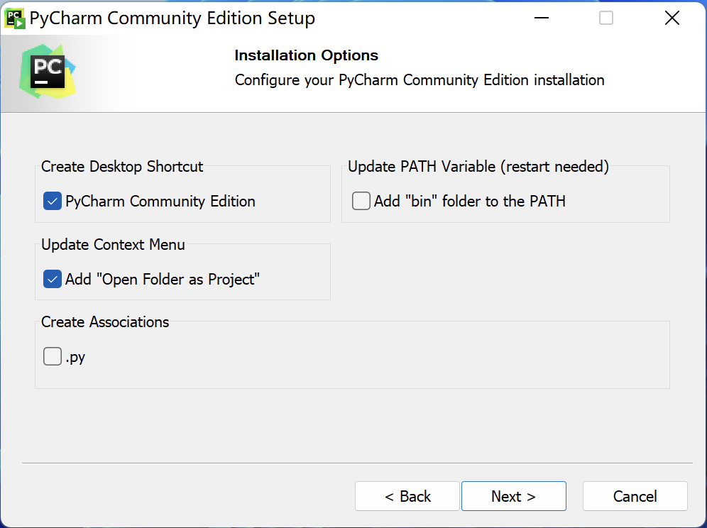
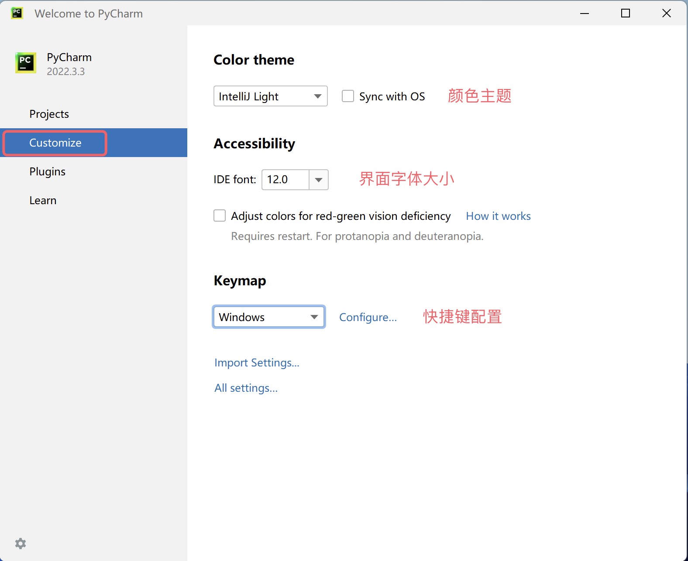
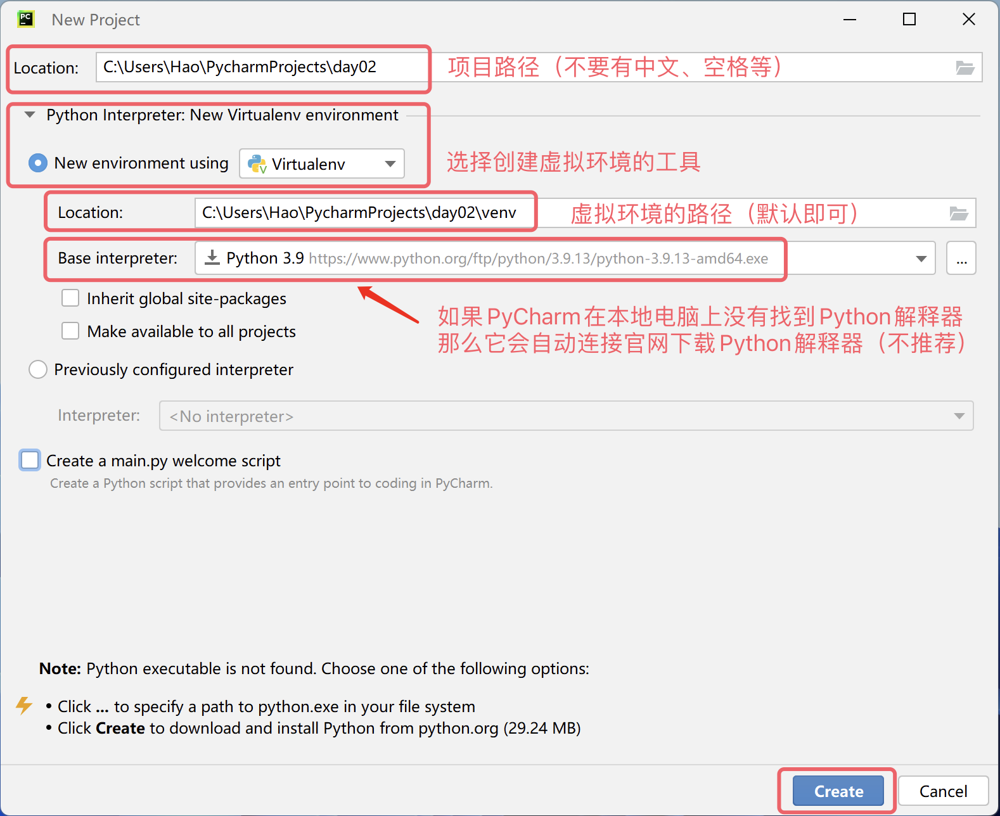

# 编辑器的选择

## 默认的交互式环境

我们打开 Windows 的“命令提示符”或“PowerShell”工具，输入`python`然后按下`Enter`键，这个命令会把我们带到一个交互式环境中。所谓交互式环境，就是我们输入一行代码并按下`Enter`键，代码马上会被执行，如果代码有产出结果，那么结果会被显示在窗口中，如下所示。

```Bash
Python 3.10.10
Type "help", "copyright", "credits" or "license" for more information.
>>> 2 * 3
6
>>> 2 + 3
5
>>>
```

> **说明**：使用 macOS 系统的用户需要打开“终端”工具，输入`python3`进入交互式环境。

如果希望退出交互式环境，可以在交互式环境中输入`quit()`，如下所示。

```Bash
>>> quit()
```

## 更好的交互式环境 - IPython

上面说的交互式环境用户体验并不怎么好，大家使用一下就能感受到。我们可以用 IPython 来替换掉它，因为 IPython 提供了更为强大的编辑和交互功能。我们可以在命令提示符或终端中使用 Python 的包管理工具`pip`来安装 IPython，如下所示。

```bash
pip install ipython
```

> **提示**：在使用上面的命令安装 IPython 之前，可以先通过`pip config set global.index-url https://pypi.doubanio.com/simple`命令或`pip config set global.index-url https://pypi.tuna.tsinghua.edu.cn/simple/`将下载源修改为国内的豆瓣镜像或清华镜像，否则下载安装的过程可能会非常的缓慢。

接下来可以使用下面的命令启动 IPython，进入交互式环境。

```bash
ipython
```

> **说明**：还有一个网页版的 IPython 名叫 Jupyter，我们在用得着它的地方再为大家介绍。

## 文本编辑神器 - Visual Studio Code

Visual Studio Code 是由微软开发能够在 Windows、 Linux 和 macOS 等操作系统上运行的代码编辑神器。它支持语法高亮、自动补全、多点编辑、运行调试等一系列便捷功能，而且能够支持多种编程语言。如果大家要选择一款高级文本编辑工具，强烈推荐 Visual Studio Code，关于它的[下载](https://code.visualstudio.com/)、安装和使用，有兴趣的读者可以自行研究。


## 交互式文本编辑器 - Jupyter Notebook
① 编辑器推荐：Jupyter Notebook。

② 初学 Python，而不是已经熟练掌握 Python 去开发、去做项目，所以需要的是一个轻量级的编辑器，简单、方便、好用，而不是复杂的编辑器。

③ 初学 Python，学习的是 Python 的 XXX 基础语句表达的是什么意思，运行后是什么结果。

④ Jupyter Notebook 清晰明了，写入代码语句，运行后就可以得到语句运算的情况，如果错误，就报错该命令行属于什么错误，如下面所示。

⑤ 如果已经熟练掌握 Python，用它去开发、去做项目，主流的几种编辑器(Pycharm、Wing等)没有多大的差别，可以都试着下载下来，选择自己喜欢的。

⑥ Jupyter Notebook 非常方便将笔记、代码、运行结果整合在一起，有写个人博客的感觉，完成一个作品的成就感。



⑦ Jupyter Notebook 文件可以直接上传 Github，当做云笔记，直接在线可读，以后需要调用时，可以根据目录直接查询笔记。

## 集成开发环境 - PyCharm

如果用 Python 语言开发商业项目，我们推荐大家使用更为专业的工具 PyCharm。PyCharm 是由捷克一家名为 [JetBrains](https://www.jetbrains.com/) 的公司针对 Python 语言提供的集成开发环境（IDE)。所谓集成开发环境，通常是指提供了编写代码、运行代码、调试代码、分析代码、版本控制等一系列强大功能和便捷操作的开发工具，因此特别适合用于商业项目的开发。我们可以在 JetBrains 公司的官方网站上找到 PyCharm 的[下载链接](<https://www.jetbrains.com/pycharm/download>)，如下图所示。


官方提供了两个 PyCharm 的版本，一个是免费的社区版（Community Edition），功能相对弱小，但对于初学者来说是完全够用的；另一个是付费的专业版（Professional Edition），功能非常强大，但需要按年或按月支付费用，新用户可以免费试用30天时间。PyCharm 的安装没有任何难度，运行下载的安装程序，几乎全部使用默认设置进行安装就可以了。对于使用 Windows 系统的小伙伴，其中有一个步骤可以按照下图所示勾选“创建桌面快捷方式”和“在右键菜单中添加"Open Folder as Project"”就可以了。



第一次运行 PyCharm 时，在提示你导入 PyCharm 设置的界面上直接选择“Do not import settings”，然后我们就可以看到如下图所示的欢迎界面。此处，我们可以先点击“Customize”选项对 PyCharm 做一些个性化的设置。



接下来，我们可以在“Projects”选项中点击“New Project”来创建一个新的项目，此处还可以“打开已有项目”或“从版本控制服务器（VCS）获取项目”，如下图所示。


创建项目的时候需要指定项目的路径并创建”虚拟环境“，我们建议每个 Python 都在自己专属的虚拟环境中运行。如果你的系统上还没 Python 环境，那么 PyCharm 会提供官网的下载链接，当你点击“Create”按钮创建项目时，它会联网下载 Python 解释器，如下图所示。



当然，我们并不推荐这么做。在系统有 Python 环境的情况下，PyCharm 通常会自动发现 Python 解释器的位置并以此为基础创建虚拟环境，所以大家看到的画面应该如下图所示。


> **说明**：上面的截图来自于 Windows 系统，如果使用 macOS 系统，你看到的项目路径和 Python 解释器路径会跟上面有所不同。

创建好项目后会出现如下图所示的画面，我们可以通过在项目文件夹上点击鼠标右键，选择“New”菜单下的“Python File”来创建一个 Python 文件，在给文件命名时建议使用英文字母和下划线的组合，创建好的 Python 文件会自动打开，进入可编辑的状态。


接下来，我们可以在代码窗口编写我们的 Python 代码。写好代码后，可以在窗口中点击鼠标右键，选择“Run”菜单项来运行代码，下面的“Run”窗口会显示代码的执行结果，如下图所示。


到这里，我们的第一个 Python 程序已经运转起来了，很酷吧！对了，PyCharm 有一个叫“每日小贴士”的弹窗，会教给你一些使用 PyCharm 的小技巧，如下图所示。如果不需要，直接关闭就可以了；如果不希望它再次出现，在关闭前可以勾选“Don't show tips on startup”。

