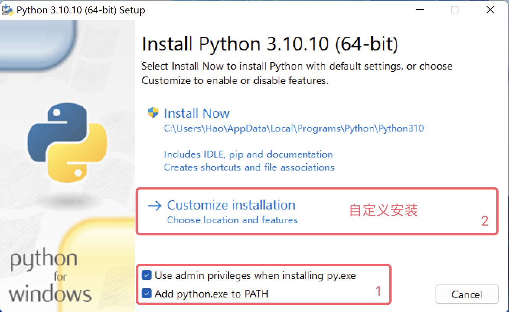
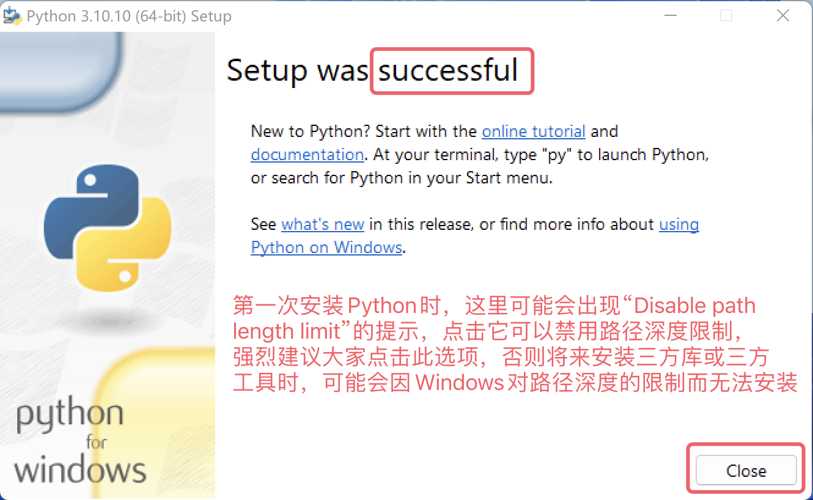
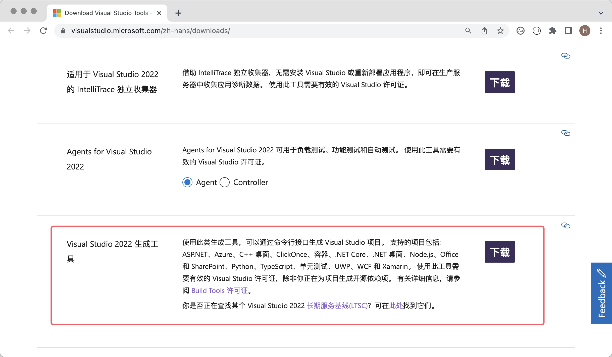

# 安装Python环境

工欲善其事，必先利其器。想要开始你的 Python 编程之旅，首先得在计算机上安装 Python 环境，简单的说就是安装运行 Python 程序需要的 Python 解释器。我们推荐大家安装官方的 Python 3 解释器，它是用 C 语言编写的，我们通常也称之为 CPython，它可能是你目前最好的选择。首先，我们需要从官方网站的[下载页面](https://www.python.org/downloads/)找到下载链接，点击“Download”按钮进入下载页面后，需要根据自己的操作系统选择合适的 Python 3安装程序，如下图所示。

进入下载页面后，有些 Python 版本并没有提供 Windows 和 macOS 系统的安装程序，只提供了源代码的压缩文件，对于熟悉 Linux 系统的小伙伴，我们可以通过源代码构建安装；对于使用 Windows 或 macOS 系统的小伙伴，我们还是**强烈建议**使用安装程序。例如，你想安装 Python 3.10，选择 Python 3.10.10 或 Python 3.10.11 就能找到 Windows 或 macOS 系统的安装包，而其他版本可能只有源代码，如下图所示。

## Windows环境

下面我们以 Windows 11为例，讲解如何在 Windows 操作系统上安装 Python 环境。双击运行从官网下载的安装程序，会打开一个安装向导，如下图所示。

首先，一定要记得勾选“Add python.exe to PATH”选项，它会帮助我们将 Python 解释器添加到 Windows 系统的 PATH 环境变量中（不理解没关系，勾上就对了）；其次，“Use admin privileges when installing py.exe”是为了在安装过程中获得管理员权限，建议勾选。然后，我们选择“Customize Installation”，使用自定义安装的模式，这是专业人士的选择，而你就（假装）是那个专业人士，不建议使用“Install Now”（默认安装）。

接下来，安装向导会提示你勾选需要的“Optional Features”（可选特性），这里咱们可以直接全选。值得一提的是其中的第2项，它是 Python 的包管理工具 pip，可以帮助我们安装三方库和三方工具，所以一定要记得勾选它，然后点击“Next”进入下一环节。

接下来是对“Advanced Options”（高级选项）的选择，这里我们建议大家只勾选“Add Python to environment variables”和“Precompile standard library”这两个选项，前者会帮助我们自动配置好环境变量，后者会预编译标准库（生成`.pyc`文件），这样在使用时就无需临时编译了。还是那句话，不理解没关系，勾上就对了。下面的“Customize install location”（自定义安装路径）**强烈建议**修改为自定义的路径，这个路径中不应该包含中文、空格或其他特殊字符，注意这一点会为你将来减少很多不必要的麻烦。设置完成后，点击“Install”开始安装。

安装成功会出现如下图所示的画面，安装成功的关键词是“successful”，如果安装失败，这里的单词会变成“failed”。

安装完成后可以打开 Windows 的“命令行提示符”或 PowerShell，然后输入`python --version`或`python -V`来检查安装是否成功，这个命令是查看 Python 解释器的版本号。如果看到如下所示的画面，那么恭喜你，Python 环境已经安装成功了。这里我们建议再检查一下 Python 的包管理工具 pip 是否可用，对应的命令是`pip --version`或`pip -V`。

> **说明**：如果安装过程报错或提示安装失败，很有可能是你的 Windows 系统缺失了一些动态链接库文件或缺少必要的构建工具导致的。可以在[微软官网](https://visualstudio.microsoft.com/zh-hans/downloads/)下载“Visual Studio 2022 生成工具”进行修复，如下图所示。如果不方便在微软官网下载的，也可以使用下面的百度云盘链接来获取修复工具，链接: https://pan.baidu.com/s/1iNDnU5UVdDX5sKFqsiDg5Q 提取码: cjs3。
>
> 
>
> 上面下载的“Visual Studio 2022 生成工具”需要联网才能运行，运行后会出现如下图所示的画面，大家可以参考下图勾选对应的选项进行修复。修复过程需要联网下载对应的软件包，这个过程可能会比较耗时间，修复成功后可能会要求重启你的操作系统。
>
> 

## macOS环境

macOS 安装 Python 环境相较于 Windows 系统更为简单，我们从官方下载的安装包是一个`pkg`文件，双击运行之后不断的点击“继续”就安装成功了，几乎不用做任何的设置和勾选，如下图所示。

安装完成后，可以在 macOS 的“终端”工具中输入`python3 --version`命令来检查是否安装成功，注意这里的命令是`python3`不是`python`！！！然后我们再检查一下包管理工具，输入命令`pip3 --version`，如下图所示。

## 其他安装方式

**Anaconda**

[Anaconda](https://www.anaconda.com/download/success)，因为 Anaconda 会帮助我们安装 Python 解释器以及一些常用的三方库，除此之外还提供了一些便捷的工具，特别适合萌新小白。

> 科普一下，PyCharm 只是一个辅助写 Python 代码的工具，它本身并不具备运行 Python 代码的能力，运行 Python 代码靠的是我们上面安装的 Python 解释器。当然，有些 PyCharm 版本在创建 Python 项目时，如果检测不到你电脑上的 Python 环境，也会提示你联网下载 Python 解释器。